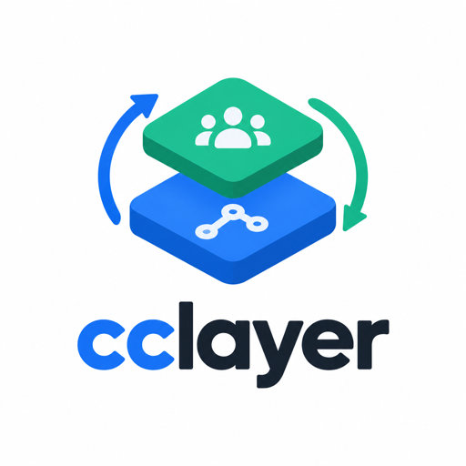
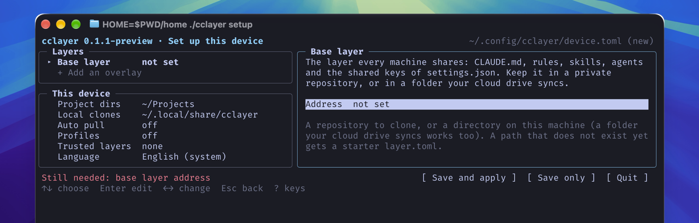

<p align="center"></p>

# cclayer

Sync your Claude Code configuration across machines: `CLAUDE.md`, rules,
skills, hooks, `settings.json`, plugins and MCP servers. What belongs to one
team, its git identity included, appears only in that team's projects.

[中文](README.zh.md) · [日本語](README.ja.md) · [Tutorial](docs/tutorial.en.md)

You use Claude Code on more than one machine, and your projects come from
more than one team. Global rules, skills, plugins and permissions should
change once and apply everywhere. Each team's git identity, rules and hooks
take effect in that team's projects and on that team's machines only, and
never mix into another team's.

cclayer splits the configuration into two kinds of git repositories: one
**public base layer** for what is the same everywhere, and one **private
overlay** per team for what belongs to it alone. A machine pulls the base
plus the overlays it may see; one command applies them, one command writes
local changes back.

<p align="center"></p>

## Just your own setup

No teams to keep apart? One base layer is all you need:

```sh
cclayer setup     # give a new directory (a cloud-synced folder works) or a private git URL
cclayer capture --add CLAUDE.md --add rules/ --add skills/   # take in what this machine has
```

On every other machine, run `cclayer setup` with the same location and
`cclayer apply` brings the configuration over. Add `private = true` under
`[layer]` in the base's `layer.toml` when only you use it and it lives
somewhere private: `check` then lets email addresses through. The
[tutorial](docs/tutorial.en.md#4-the-simplest-setup-one-person-several-machines-directory-sync)
walks through it.

## How it works

A **layer** is a directory with a `layer.toml` at its root. Usually it is a
git repository that cclayer clones; it can also be a plain directory on this
machine, for example inside a folder your cloud drive syncs, with no git at all.

- The **base** layer holds what every device gets: `CLAUDE.md`, `rules/`,
  `skills/`, `output-styles/`, `agents/`, hook scripts, the shared keys of
  `settings.json`, plugin and marketplace lists, MCP definitions. It contains
  no identity, so it can be public.
- An **overlay** holds one organization's git identity, hooks, the remote URL
  patterns of its repositories, and the files written into those
  repositories' working trees: keys of `.claude/settings.local.json` and a
  managed block in `CLAUDE.local.md`. An overlay never writes under
  `~/.claude/`.

The device manifest `~/.config/cclayer/device.toml` lists the layers enabled
on this machine, where their clones live and where projects are found. It is
never committed anywhere. Runtime state (`~/.claude.json`, logins,
`history.jsonl`, `projects/`) is never read into a layer, and
`permissions.allow`, `permissions.ask`, `permissions.defaultMode` and `env`
stay on the device.

## Install

```sh
brew install --cask zhaojiannet/tap/cclayer      # macOS
brew upgrade --cask cclayer                      # later, for a new version
```

Linux and Windows binaries are on the [Releases page](https://github.com/zhaojiannet/cclayer/releases). Requires git; the
plugin, MCP and purge steps also need Claude Code 2.1.288 or later.

## Use

```sh
cclayer setup            # guided first-time setup: layers, roots, credentials, apply, doctor
cclayer init             # clone the layers of a manifest you wrote yourself
cclayer apply            # apply the layers to this device
cclayer capture          # write local edits back into the layer clones
cclayer push             # capture, then commit and push the layer repositories
cclayer check            # refuse content that must not enter a layer
cclayer status           # per-layer git state, matched projects
cclayer keys setup <layer>   # give this device credentials for one layer repository
cclayer layer add <name> <url>  # add one overlay to this device
cclayer leave <layer>    # purge a layer's projects and remove it from this device
cclayer doctor           # known Claude Code and git pitfalls
cclayer env | run        # select a per-team CLAUDE_CONFIG_DIR (profiles mode)
cclayer version
```

`setup` is a full-screen editor. The left column lists the layers of the
device (each a git URL or a local directory; a path that does not exist yet
gets a starter `layer.toml`) and the settings of the device itself: project
roots, the identity for unmatched repositories (once there is an overlay),
auto-pull, profiles, trusted layers and the language. The right column explains the selected item, holds
its fields (an overlay's access method, or the identity and match rules read
from its `layer.toml`) and says what saving will do. The bottom line says
what is still missing, next to the Save and apply, Save only and Quit
buttons; nothing is written before you save. Then it writes the device
manifest, sets up the credentials, clones the layers, applies them and runs
`doctor`. Running `setup` again opens on the saved values.
`layer add <name> <url|directory>` adds one overlay without the page:
credential, clone, checks and blocklist, and a failed step leaves the manifest
as it was. A repository URL gets a credential question unless you pass
`--method none` (a public repository, or credentials git already has); a
directory must already hold a `layer.toml`, since only setup writes a starter
one. `init` reads a manifest you wrote yourself, clones the layers it lists
and fills the blocklist, asking only whether to turn on auto-pull; without a
manifest it asks for the layer URLs, project roots and default identity in
plain prompts and writes one. You run `apply` after it. Pass `--accessible` for plain line prompts instead
of the full-screen editor; setup switches to them when stdin is not a
terminal.

Messages are in English, Simplified Chinese or Japanese. `CCLAYER_LANG`
decides first, then `lang = "zh"` (or `en`, `ja`) in the device manifest,
then the locale: the first of `LC_ALL`, `LC_MESSAGES` and `LANG` that is set,
with English for a language cclayer does not have. Errors stay in English so
they can be searched.

`apply` runs `check` first, then mirrors the base into `~/.claude`, merges
the owned keys of `settings.json`, regenerates `~/.gitconfig.cclayer` and
one include block at the end of `~/.gitconfig`, re-applies plugins and MCP
servers after a single confirmation, and writes the overlay files into every
matched project. It remembers what it wrote: a file edited on the device
while the layer also changed is a conflict that interactive `apply` asks
about and `apply --hook` leaves alone. Overwritten files are backed up under
`~/.local/state/cclayer/backups/`. `apply --pull` fast-forwards each git
layer's clone first; a clone with uncommitted changes, no upstream branch, no
network or a diverged branch is reported and skipped, and a local directory
has nothing to pull.

`capture` is the reverse: device changes go back to the owning layer when
they differ from what the last `apply` wrote, each file passing `check`
first. Device-only files are listed and admitted with `--add <file or directory>`. Injected
files edited inside matched projects go back to their overlay too; when two
projects disagree, `--from <project>` names the one to take. `capture` never
commits.

`push` is the upload half of a sync, as `apply --pull` is the download
half. It runs `capture` and `check`, lists what each layer repository would
commit, asks once (`--yes` skips the question), then commits with
`-m <message>` or "cclayer: capture from <host>", rebases onto commits
another machine pushed meanwhile and pushes. A conflict with those commits
stops it with the clone as it was, for you to merge by hand. Directory
layers are left out; whatever syncs their folder carries them.

`leave` runs `claude purge` on each of the layer's projects, removes the
injected files and the layer's credentials, regenerates the git
configuration without the layer, saves the manifest and deletes the clone
last. It refuses while the clone has uncommitted or unpushed work unless
`--force`. A layer that is a directory you pointed cclayer at is kept.

Plugin and marketplace commands run once per device; `apply
--replay-plugins` runs them again. For the base layer, marketplaces and
user plugins the device already has are skipped either way, since
registering a marketplace again drops settings such as `autoUpdate`. MCP servers are re-added only when
`claude mcp get` does not know them; `--mcp-force` replaces them.

### Credentials for layer repositories

A device needs to reach its layer repositories and nothing else. `keys
setup <layer>` offers two ways, and a device may mix them:

- **Deploy key** (`--method deploy-key`): an ed25519 key is generated under
  `~/.ssh/cclayer-<layer>`, a `Host cclayer-<layer>` stanza is added to
  `~/.ssh/config` (`--port-443` routes through `ssh.github.com:443`), the
  layer URL is rewritten to use the alias, and the public key is attached to
  the repository with write access through `gh api` when `gh` is logged in
  as an administrator of that repository. Otherwise the exact command and
  the public key are printed for you to run elsewhere. A deploy key opens
  one repository and nothing else, and is not tied to any account.
- **HTTPS token** (`--method token`): you create a fine-grained token on
  GitHub (resource owner, only the selected repositories, Contents read and
  write); cclayer stores it in the git credential helper for that repository
  path, never in a file it writes. Use this where you are not an
  administrator of the repository or where SSH is blocked.

The deploy key path ends with `git ls-remote` to confirm access. The token
path verifies first, through `GIT_ASKPASS` and without any credential
helper, and stores the token only if the repository did not reject it; a
network failure stores it anyway and says so.
`keys list` shows the method per layer; `keys remove <layer>` deletes the
key files and stanza, or tells you how to drop the token, and prints what to
revoke on GitHub. Repositories of the teams you work for keep whatever
credentials those teams gave you; cclayer only ever touches its own layer
repositories.

### Profiles

With `profiles = true` in the device manifest, every overlay gets its own
Claude Code config directory under `~/.claude-profiles/<layer>` (logins,
sessions and prompt history per team; `profile_dir` in the manifest moves the
parent directory). `apply` copies the base layer's
mirrored paths, except `CLAUDE.md`, which Claude Code reads from
`~/.claude` anyway, and the owned settings keys into each profile, as copies
rather than symlinks. `cclayer env [dir]` prints the `export CLAUDE_CONFIG_DIR=...`
line for the overlay that matches a project (for direnv or your shell), and
`cclayer run [dir] -- claude` starts a command with it set.

### Device manifest

```toml
layers = ["base", "personal", "acme"]    # base first; later layers win
default_identity = ""                    # empty: git refuses to commit where no overlay matches
roots = ["~/Projects"]                   # where projects are discovered
auto_pull = false                        # SessionStart hook does nothing while false
profiles = false                         # one config directory per overlay, see Profiles
profile_dir = "~/.claude-profiles"       # where those directories live
blocklist = ["acme", "acme-inc"]         # filled by init from the overlays
blocklist_except = []                    # words the base may carry anyway, never added to blocklist
trust_exec = []                          # layers whose git fragment may set keys that run programs
clone_dir = "~/.local/share/cclayer"     # where repository layers are cloned (the default)

[clone]
base = "~/.local/share/cclayer/base"
acme = "~/.local/share/cclayer/acme"

[repo]
base = "https://github.com/you/cclayer-base.git"
acme = "git@github.com:you/cclayer-acme.git"
```

A layer without a `[repo]` entry is a local directory: cclayer reads and
writes the `[clone]` path as it is, never clones or pulls, `status` marks it
`local directory` and `leave` keeps it. cclayer never runs git inside it, even
when it holds a `.git`, since that configuration was not written by cclayer. Put that directory in a folder your
cloud drive syncs and give every machine the same path in `setup` to sync
without git. `setup` writes a starter `layer.toml` when the path does not
exist yet. Repository layers are cloned into `~/.local/share/cclayer/<layer>`.
`clone_dir` in the device manifest, or the Local clones row of setup, picks
another folder; setup moves the clones cclayer made there when you save.
The repositories on GitHub do not move. `CCLAYER_DEVICE` moves the manifest and `CCLAYER_STATE` the state
directory (`~/.local/state/cclayer`); `CCLAYER_LANG` picks the message
language.

### Base layer

```
layer.toml
claude/                 mirrored into ~/.claude: CLAUDE.md, rules/, skills/, hooks/, ...
claude/settings.json    the keys listed in settings_keys
mcp/<name>.json         one MCP server per file, ${VAR} for secrets
git/fragment.gitconfig  optional raw git config; no [user], no remote URLs
```

```toml
[layer]
name = "base"
kind = "base"
private = false          # true: one person, private location; check lets emails through

[claude]
paths = ["CLAUDE.md", "rules/", "skills/", "output-styles/", "hooks/", "statusline.sh"]
settings_keys = ["attribution", "permissions.deny", "hooks", "statusLine",
  "enabledPlugins", "extraKnownMarketplaces", "outputStyle", "effortLevel", "theme"]
ignore = ["skills/.trash/", "skills/synced/"]

[git]
fragment = "git/fragment.gitconfig"
```

### Overlay

```
layer.toml
project/settings.local.json   keys written into matched projects
project/CLAUDE.local.md       the managed block
git/fragment.gitconfig        optional hooks and aliases, applied in matched repositories only
```

```toml
[layer]
name = "acme"
kind = "overlay"

[identity]
name = "Full Name"
email = "me@acme.example"

[[match]]
remote = "github.com/acme-inc/*"

[inject]
settings_keys = ["permissions.deny", "enabledPlugins", "extraKnownMarketplaces"]
claude_local = "project/CLAUDE.local.md"

[git]
fragment = "git/fragment.gitconfig"
```

A pattern names the host and the owner literally, as in
`github.com/acme-inc/*`; a wildcard there would let one overlay claim other
teams' repositories, and two overlays may not name the same host and owner.
A project is matched when any of its git remotes fits a
pattern, compared without case as hosting services compare owner and
repository names; a project that fits two overlays is reported and skipped. Overlay plugins are installed
with `claude plugin install --scope local` inside the matched project.

A git fragment may set the usual workflow settings (`pull.rebase`,
`push.default`, `merge.conflictstyle`, `diff.algorithm`, `color.ui`, ...),
listed key by key. Anything else, aliases included, is refused unless the
layer is listed in the device manifest's `trust_exec`: an alias can run any
program, and so can `core.hooksPath`, `credential.helper`,
`core.sshCommand`, `url.*.insteadOf` and many more. What lands in the
generated git configuration is the fragment as git parsed it, written out
again. Settings keys work the same way: appearance, model, context and
workflow preferences, `attribution`, `permissions.deny` and the keys that
only restrict Claude Code are merged as they are; any other key, in
particular the ones that run programs (`hooks`, `statusLine`, `apiKeyHelper`
and the other helper commands), register marketplaces
(`extraKnownMarketplaces`) or switch plugins on (`enabledPlugins`), is shown and
confirmed by interactive `apply` and skipped by `apply --hook`, whether the
base writes it into `~/.claude/settings.json` or an overlay into a project's
`settings.local.json`. Keys that only restrict Claude Code (`permissions.deny`,
`disableAllHooks`, ...) are merged without a question only while the layer
keeps or adds to what the device has; dropping or loosening a limit is
confirmed too. A key the layer only keeps off, set to `false` where the
device has it off or unset, turns nothing on and is merged without a
question; switches where `false` loosens a limit (`disable*`, anything under
`permissions` or `sandbox`, `respectGitignore`, `useAutoModeDuringPlan`) are
not covered by this. Mirrored files Claude Code may run get the same
treatment: anything under `hooks/`, `skills/`, `commands/` or `agents/`,
every file that is not markdown, and executable or shebang files. Their
content is listed before they are written, also when the layer's version
would overwrite a local edit. A file confirmed once on this device is not
asked about again while its path and content stay the same.
Writes never follow symbolic links inside `~/.claude`, a layer clone or a
project working tree, and a layer holds regular files only: a link anywhere
below the layer directory stops `apply` and `check`, and `capture` never
writes through one.

### Git identity

cclayer owns `~/.gitconfig.cclayer` and one file per overlay under
`~/.gitconfig.cclayer.d/`. `~/.gitconfig` gets a single include block as its
last lines; its other contents, credential helper included, are not touched.
`apply` finds the block by the path it includes, so a block whose marker
comment was lost is still replaced, not added twice.
Each overlay's identity, hooks and aliases apply only in repositories whose
remote matches, through `includeIf "hasconfig:remote.*.url:..."`. With
`default_identity` empty, `user.useConfigOnly` makes git refuse to commit in
repositories no overlay matches.

### SessionStart hook

Put this in the base layer's `claude/settings.json` to pull and apply at the
start of every session once `auto_pull = true`:

```json
{
  "hooks": {
    "SessionStart": [{
      "matcher": "startup",
      "hooks": [{ "type": "command", "command": "command -v cclayer >/dev/null && cclayer apply --hook || true" }]
    }]
  }
}
```

### Credentials

cclayer manages credentials for its own layer repositories only, through
`keys setup` as described above; a layer that is a local directory needs
none. Claude Code logins and the credentials your teams gave you for their
repositories are never read, copied or written.

## Develop

```sh
cp .env.example .env
docker compose up -d
docker compose exec app go test ./...
```

MIT license.
